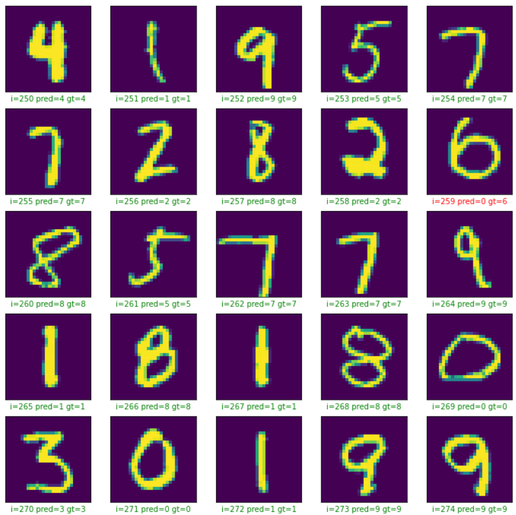

# SimpleImageClassification

This is probably one of the simplest classification problem that learns to classify handwritten digits using classic MNIST Dataset.
It uses tf.keras, a high-level API to build and train models and TensorFlow as a backend.

Below is the result predicted by the model after just 4 epochs.  

 

